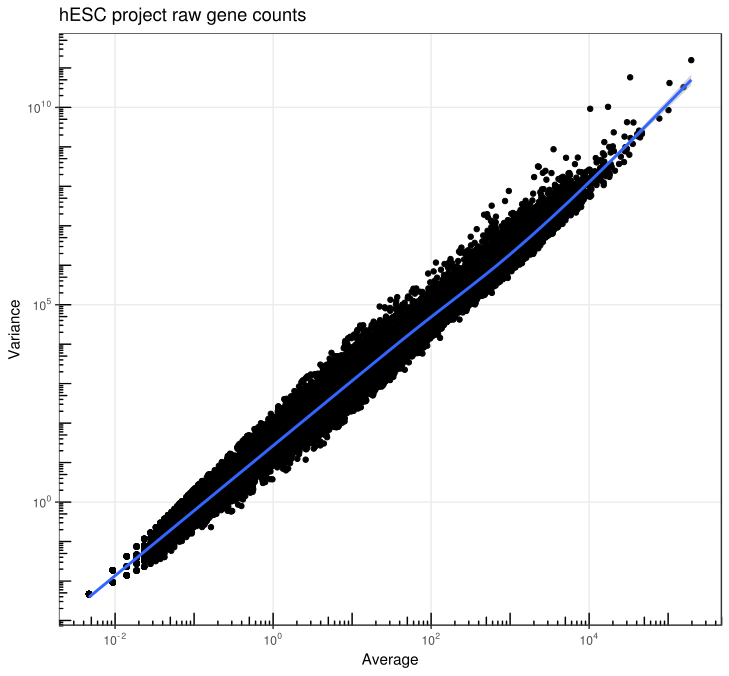
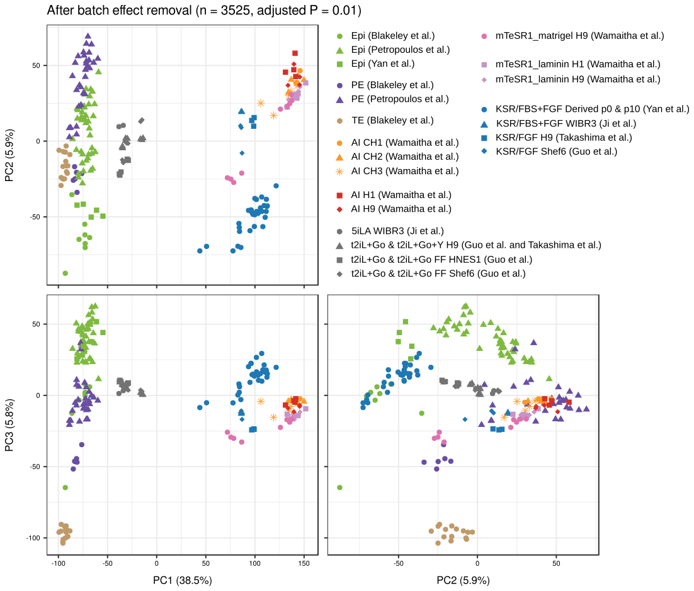
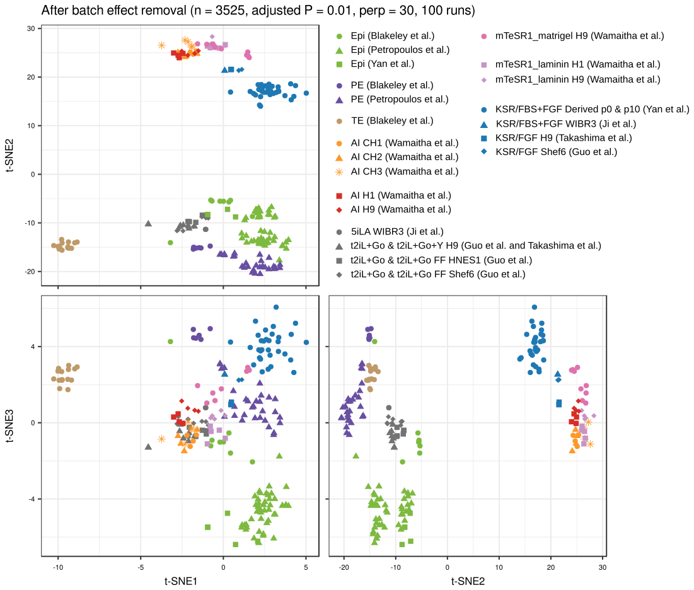
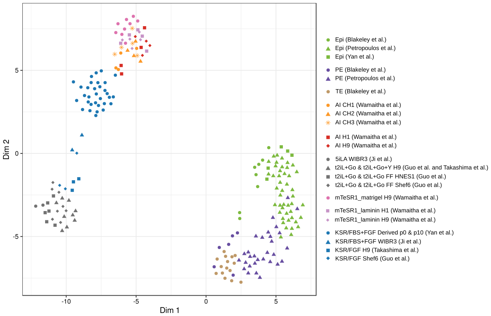

Analysis of hESC expression data
================
Gregorio Alanis-Lobato

Description of the project
--------------------------

This project had three main goals:

1.  Integration of publicly available RNA-seq data sets profiling the transcriptome of human embryonic stem cells (hESCs) maintained under different culture conditions, as well as cells from the human epiblast (Epi), primitive endoderm (PE) and Trophectoderm (TE).
2.  Comparison between the gene expression profiles of all these different cell types in order to identify clusters grouping similar samples.
3.  Differential expression analysis contrasting the different culture conditions to identify up- and down-regulated genes.

Pre-requisites
--------------

The bioinformatic pipeline that we prepared requires the following software packages:

-   Python v3.5.5 (Anaconda, Inc.)
    -   FastQC v0.11.6
    -   multiqc v0.9
    -   cutadapt v1.18
-   R v3.5.1
    -   Bioconductor v3.7
        -   biomaRt v2.36.1
        -   tximport v1.8.0
        -   DESeq2 v1.20.0
        -   limma v3.36.5
        -   scran v1.8.4
    -   dplyr v0.7.6
    -   readr v1.1.1
    -   ggplot2 v3.0.0
    -   DrImpute v1.1
    -   FactoMineR v1.41
    -   Rtsne v0.13
    -   plotly v4.8.0
-   Other
    -   Trim Galore! v0.5.0
    -   salmon v0.11.3
    -   GNU parallel 20141022
-   In development
    -   <https://github.com/ppapasaikas/griph>
    -   <https://github.com/galanisl/FunEnrich>

RNA-seq data
------------

We integrated bulk and single-cell RNA-seq data from the following studies:

| sample\_name                        | cell\_line   | medium           | rna\_seq     | technology   | ENA\_study\_ID |
|:------------------------------------|:-------------|:-----------------|:-------------|:-------------|:---------------|
| ERR1042010                          | Epi          | none             | single\_cell | single\_read | PRJEB11202     |
| ERR1042012                          | Epi          | none             | single\_cell | single\_read | PRJEB11202     |
| ERR1042013                          | Epi          | none             | single\_cell | single\_read | PRJEB11202     |
| ERR1042014                          | Epi          | none             | single\_cell | single\_read | PRJEB11202     |
| ERR1042016                          | Epi          | none             | single\_cell | single\_read | PRJEB11202     |
| ERR1042018                          | Epi          | none             | single\_cell | single\_read | PRJEB11202     |
| ERR1042019                          | Epi          | none             | single\_cell | single\_read | PRJEB11202     |
| ERR1042313                          | Epi          | none             | single\_cell | single\_read | PRJEB11202     |
| ERR1042038                          | Epi          | none             | single\_cell | single\_read | PRJEB11202     |
| ERR1042049                          | Epi          | none             | single\_cell | single\_read | PRJEB11202     |
| ERR1042081                          | Epi          | none             | single\_cell | single\_read | PRJEB11202     |
| ERR1042084                          | Epi          | none             | single\_cell | single\_read | PRJEB11202     |
| ERR1042092                          | Epi          | none             | single\_cell | single\_read | PRJEB11202     |
| ERR1042199                          | Epi          | none             | single\_cell | single\_read | PRJEB11202     |
| ERR1042201                          | Epi          | none             | single\_cell | single\_read | PRJEB11202     |
| ERR1042226                          | Epi          | none             | single\_cell | single\_read | PRJEB11202     |
| ERR1042414                          | Epi          | none             | single\_cell | single\_read | PRJEB11202     |
| ERR1042415                          | Epi          | none             | single\_cell | single\_read | PRJEB11202     |
| ERR1042416                          | Epi          | none             | single\_cell | single\_read | PRJEB11202     |
| ERR1042418                          | Epi          | none             | single\_cell | single\_read | PRJEB11202     |
| ERR1042419                          | Epi          | none             | single\_cell | single\_read | PRJEB11202     |
| ERR1042446                          | Epi          | none             | single\_cell | single\_read | PRJEB11202     |
| ERR1042455                          | Epi          | none             | single\_cell | single\_read | PRJEB11202     |
| ERR1042457                          | Epi          | none             | single\_cell | single\_read | PRJEB11202     |
| ERR1042480                          | Epi          | none             | single\_cell | single\_read | PRJEB11202     |
| ERR1042349                          | Epi          | none             | single\_cell | single\_read | PRJEB11202     |
| ERR1042351                          | Epi          | none             | single\_cell | single\_read | PRJEB11202     |
| ERR1042358                          | Epi          | none             | single\_cell | single\_read | PRJEB11202     |
| ERR1042359                          | Epi          | none             | single\_cell | single\_read | PRJEB11202     |
| ERR1042371                          | Epi          | none             | single\_cell | single\_read | PRJEB11202     |
| ERR1042372                          | Epi          | none             | single\_cell | single\_read | PRJEB11202     |
| ERR1042376                          | Epi          | none             | single\_cell | single\_read | PRJEB11202     |
| ERR1042401                          | Epi          | none             | single\_cell | single\_read | PRJEB11202     |
| ERR1042403                          | Epi          | none             | single\_cell | single\_read | PRJEB11202     |
| ERR1042616                          | Epi          | none             | single\_cell | single\_read | PRJEB11202     |
| ERR1042769                          | Epi          | none             | single\_cell | single\_read | PRJEB11202     |
| ERR1042802                          | Epi          | none             | single\_cell | single\_read | PRJEB11202     |
| ERR1042803                          | Epi          | none             | single\_cell | single\_read | PRJEB11202     |
| ERR1042808                          | Epi          | none             | single\_cell | single\_read | PRJEB11202     |
| ERR1042819                          | Epi          | none             | single\_cell | single\_read | PRJEB11202     |
| ERR1042848                          | Epi          | none             | single\_cell | single\_read | PRJEB11202     |
| ERR1042853                          | Epi          | none             | single\_cell | single\_read | PRJEB11202     |
| ERR1042855                          | Epi          | none             | single\_cell | single\_read | PRJEB11202     |
| ERR1042867                          | Epi          | none             | single\_cell | single\_read | PRJEB11202     |
| ERR1042869                          | Epi          | none             | single\_cell | single\_read | PRJEB11202     |
| ERR1042314                          | PE           | none             | single\_cell | single\_read | PRJEB11202     |
| ERR1042037                          | PE           | none             | single\_cell | single\_read | PRJEB11202     |
| ERR1042045                          | PE           | none             | single\_cell | single\_read | PRJEB11202     |
| ERR1042007                          | PE           | none             | single\_cell | single\_read | PRJEB11202     |
| ERR1042008                          | PE           | none             | single\_cell | single\_read | PRJEB11202     |
| ERR1042009                          | PE           | none             | single\_cell | single\_read | PRJEB11202     |
| ERR1042021                          | PE           | none             | single\_cell | single\_read | PRJEB11202     |
| ERR1042025                          | PE           | none             | single\_cell | single\_read | PRJEB11202     |
| ERR1042420                          | PE           | none             | single\_cell | single\_read | PRJEB11202     |
| ERR1042429                          | PE           | none             | single\_cell | single\_read | PRJEB11202     |
| ERR1042430                          | PE           | none             | single\_cell | single\_read | PRJEB11202     |
| ERR1042431                          | PE           | none             | single\_cell | single\_read | PRJEB11202     |
| ERR1042432                          | PE           | none             | single\_cell | single\_read | PRJEB11202     |
| ERR1042433                          | PE           | none             | single\_cell | single\_read | PRJEB11202     |
| ERR1042435                          | PE           | none             | single\_cell | single\_read | PRJEB11202     |
| ERR1042443                          | PE           | none             | single\_cell | single\_read | PRJEB11202     |
| ERR1042445                          | PE           | none             | single\_cell | single\_read | PRJEB11202     |
| ERR1042458                          | PE           | none             | single\_cell | single\_read | PRJEB11202     |
| ERR1042464                          | PE           | none             | single\_cell | single\_read | PRJEB11202     |
| ERR1042467                          | PE           | none             | single\_cell | single\_read | PRJEB11202     |
| ERR1042468                          | PE           | none             | single\_cell | single\_read | PRJEB11202     |
| ERR1042469                          | PE           | none             | single\_cell | single\_read | PRJEB11202     |
| ERR1042477                          | PE           | none             | single\_cell | single\_read | PRJEB11202     |
| ERR1042479                          | PE           | none             | single\_cell | single\_read | PRJEB11202     |
| ERR1042489                          | PE           | none             | single\_cell | single\_read | PRJEB11202     |
| ERR1042490                          | PE           | none             | single\_cell | single\_read | PRJEB11202     |
| ERR1042491                          | PE           | none             | single\_cell | single\_read | PRJEB11202     |
| ERR1042492                          | PE           | none             | single\_cell | single\_read | PRJEB11202     |
| ERR1042817                          | PE           | none             | single\_cell | single\_read | PRJEB11202     |
| ERR1042851                          | PE           | none             | single\_cell | single\_read | PRJEB11202     |
| ERR1924222                          | H9           | t2iL+Go          | bulk         | single\_read | PRJEB20388     |
| ERR1924223                          | H9           | t2iL+Go          | bulk         | single\_read | PRJEB20388     |
| ERR1924224                          | H9           | t2iL+Go          | bulk         | single\_read | PRJEB20388     |
| ERR1924225                          | H9           | t2iL+Go+Y        | bulk         | single\_read | PRJEB20388     |
| ERR1924226                          | H9           | t2iL+Go+Y        | bulk         | single\_read | PRJEB20388     |
| ERR1924227                          | H9           | t2iL+Go+Y        | bulk         | single\_read | PRJEB20388     |
| ERR1924243                          | HNES1        | t2iL+Go          | bulk         | single\_read | PRJEB20388     |
| ERR1924244                          | HNES1        | t2iL+Go          | bulk         | single\_read | PRJEB20388     |
| ERR1924245                          | HNES1        | t2iL+Go          | bulk         | single\_read | PRJEB20388     |
| ERR1924240                          | HNES1        | t2iL+Go FF       | bulk         | single\_read | PRJEB20388     |
| ERR1924241                          | HNES1        | t2iL+Go FF       | bulk         | single\_read | PRJEB20388     |
| ERR1924242                          | HNES1        | t2iL+Go FF       | bulk         | single\_read | PRJEB20388     |
| ERR1924246                          | Shef6        | KSR/FGF          | bulk         | single\_read | PRJEB20388     |
| ERR1924247                          | Shef6        | KSR/FGF          | bulk         | single\_read | PRJEB20388     |
| ERR1924248                          | Shef6        | KSR/FGF          | bulk         | single\_read | PRJEB20388     |
| ERR1924228                          | Shef6        | t2iL+Go FF       | bulk         | single\_read | PRJEB20388     |
| ERR1924229                          | Shef6        | t2iL+Go FF       | bulk         | single\_read | PRJEB20388     |
| ERR1924230                          | Shef6        | t2iL+Go FF       | bulk         | single\_read | PRJEB20388     |
| ERR1924231                          | Shef6\_p18   | t2iL+Go          | bulk         | single\_read | PRJEB20388     |
| ERR1924232                          | Shef6\_p18   | t2iL+Go          | bulk         | single\_read | PRJEB20388     |
| ERR1924234                          | Shef6\_p26   | t2iL+Go          | bulk         | single\_read | PRJEB20388     |
| ERR1924235                          | Shef6\_p26   | t2iL+Go          | bulk         | single\_read | PRJEB20388     |
| ERR1924236                          | Shef6\_p26   | t2iL+Go          | bulk         | single\_read | PRJEB20388     |
| ERR590408                           | H9           | KSR/FGF          | bulk         | paired\_end  | PRJEB7132      |
| ERR590410                           | H9           | KSR/FGF          | bulk         | paired\_end  | PRJEB7132      |
| ERR590401                           | H9           | KSR/FGF          | bulk         | paired\_end  | PRJEB7132      |
| ERR590400                           | H9           | t2iL+Go          | bulk         | paired\_end  | PRJEB7132      |
| ERR590398                           | H9           | t2iL+Go          | bulk         | paired\_end  | PRJEB7132      |
| ERR590399                           | H9           | t2iL+Go          | bulk         | paired\_end  | PRJEB7132      |
| GSM922224                           | Derived\_p0  | KSR/FBS+FGF      | single\_cell | single\_read | PRJNA153427    |
| GSM922225                           | Derived\_p0  | KSR/FBS+FGF      | single\_cell | single\_read | PRJNA153427    |
| GSM922226                           | Derived\_p0  | KSR/FBS+FGF      | single\_cell | single\_read | PRJNA153427    |
| GSM922227                           | Derived\_p0  | KSR/FBS+FGF      | single\_cell | single\_read | PRJNA153427    |
| GSM922228                           | Derived\_p0  | KSR/FBS+FGF      | single\_cell | single\_read | PRJNA153427    |
| GSM922230                           | Derived\_p0  | KSR/FBS+FGF      | single\_cell | single\_read | PRJNA153427    |
| GSM922250                           | Derived\_p10 | KSR/FBS+FGF+L    | single\_cell | single\_read | PRJNA153427    |
| GSM922251                           | Derived\_p10 | KSR/FBS+FGF+L    | single\_cell | single\_read | PRJNA153427    |
| GSM922252                           | Derived\_p10 | KSR/FBS+FGF+L    | single\_cell | single\_read | PRJNA153427    |
| GSM922253                           | Derived\_p10 | KSR/FBS+FGF+L    | single\_cell | single\_read | PRJNA153427    |
| GSM922254                           | Derived\_p10 | KSR/FBS+FGF+L    | single\_cell | single\_read | PRJNA153427    |
| GSM922255                           | Derived\_p10 | KSR/FBS+FGF+L    | single\_cell | single\_read | PRJNA153427    |
| GSM922256                           | Derived\_p10 | KSR/FBS+FGF+L    | single\_cell | single\_read | PRJNA153427    |
| GSM922257                           | Derived\_p10 | KSR/FBS+FGF+L    | single\_cell | single\_read | PRJNA153427    |
| GSM922258                           | Derived\_p10 | KSR/FBS+FGF+L    | single\_cell | single\_read | PRJNA153427    |
| GSM922259                           | Derived\_p10 | KSR/FBS+FGF+L    | single\_cell | single\_read | PRJNA153427    |
| GSM922260                           | Derived\_p10 | KSR/FBS+FGF+L    | single\_cell | single\_read | PRJNA153427    |
| GSM922261                           | Derived\_p10 | KSR/FBS+FGF+L    | single\_cell | single\_read | PRJNA153427    |
| GSM922262                           | Derived\_p10 | KSR/FBS+FGF+L    | single\_cell | single\_read | PRJNA153427    |
| GSM922263                           | Derived\_p10 | KSR/FBS+FGF+L    | single\_cell | single\_read | PRJNA153427    |
| GSM922264                           | Derived\_p10 | KSR/FBS+FGF+L    | single\_cell | single\_read | PRJNA153427    |
| GSM922265                           | Derived\_p10 | KSR/FBS+FGF+L    | single\_cell | single\_read | PRJNA153427    |
| GSM922266                           | Derived\_p10 | KSR/FBS+FGF+L    | single\_cell | single\_read | PRJNA153427    |
| GSM922267                           | Derived\_p10 | KSR/FBS+FGF+L    | single\_cell | single\_read | PRJNA153427    |
| GSM922268                           | Derived\_p10 | KSR/FBS+FGF+L    | single\_cell | single\_read | PRJNA153427    |
| GSM922269                           | Derived\_p10 | KSR/FBS+FGF+L    | single\_cell | single\_read | PRJNA153427    |
| GSM922270                           | Derived\_p10 | KSR/FBS+FGF+L    | single\_cell | single\_read | PRJNA153427    |
| GSM922271                           | Derived\_p10 | KSR/FBS+FGF+L    | single\_cell | single\_read | PRJNA153427    |
| GSM922272                           | Derived\_p10 | KSR/FBS+FGF+L    | single\_cell | single\_read | PRJNA153427    |
| GSM922273                           | Derived\_p10 | KSR/FBS+FGF+L    | single\_cell | single\_read | PRJNA153427    |
| GSM922274                           | Derived\_p10 | KSR/FBS+FGF+L    | single\_cell | single\_read | PRJNA153427    |
| GSM922275                           | Derived\_p10 | KSR/FBS+FGF+L    | single\_cell | single\_read | PRJNA153427    |
| GSM922207                           | Epi          | none             | single\_cell | single\_read | PRJNA153427    |
| GSM922208                           | Epi          | none             | single\_cell | single\_read | PRJNA153427    |
| GSM922216                           | Epi          | none             | single\_cell | single\_read | PRJNA153427    |
| GSM922219                           | Epi          | none             | single\_cell | single\_read | PRJNA153427    |
| GSM922220                           | Epi          | none             | single\_cell | single\_read | PRJNA153427    |
| GSM1868823                          | Epi          | none             | single\_cell | paired\_end  | PRJNA277181    |
| GSM1868822                          | Epi          | none             | single\_cell | paired\_end  | PRJNA277181    |
| GSM1868821                          | Epi          | none             | single\_cell | paired\_end  | PRJNA277181    |
| GSM1868819                          | Epi          | none             | single\_cell | paired\_end  | PRJNA277181    |
| GSM1868820                          | Epi          | none             | single\_cell | paired\_end  | PRJNA277181    |
| GSM1868818                          | Epi          | none             | single\_cell | paired\_end  | PRJNA277181    |
| GSM1624228                          | Epi          | none             | single\_cell | paired\_end  | PRJNA277181    |
| GSM1868817                          | Epi          | none             | single\_cell | paired\_end  | PRJNA277181    |
| GSM1868810                          | PE           | none             | single\_cell | paired\_end  | PRJNA277181    |
| GSM1868811                          | PE           | none             | single\_cell | paired\_end  | PRJNA277181    |
| GSM1868812                          | PE           | none             | single\_cell | paired\_end  | PRJNA277181    |
| GSM1868813                          | PE           | none             | single\_cell | paired\_end  | PRJNA277181    |
| GSM1868814                          | PE           | none             | single\_cell | paired\_end  | PRJNA277181    |
| GSM1624232                          | PE           | none             | single\_cell | paired\_end  | PRJNA277181    |
| GSM1624222                          | TE           | none             | single\_cell | paired\_end  | PRJNA277181    |
| GSM1624223                          | TE           | none             | single\_cell | paired\_end  | PRJNA277181    |
| GSM1624224                          | TE           | none             | single\_cell | paired\_end  | PRJNA277181    |
| GSM1624225                          | TE           | none             | single\_cell | paired\_end  | PRJNA277181    |
| GSM1624226                          | TE           | none             | single\_cell | paired\_end  | PRJNA277181    |
| GSM1624227                          | TE           | none             | single\_cell | paired\_end  | PRJNA277181    |
| GSM1624229                          | TE           | none             | single\_cell | paired\_end  | PRJNA277181    |
| GSM1624230                          | TE           | none             | single\_cell | paired\_end  | PRJNA277181    |
| GSM1624231                          | TE           | none             | single\_cell | paired\_end  | PRJNA277181    |
| GSM1624233                          | TE           | none             | single\_cell | paired\_end  | PRJNA277181    |
| GSM1624234                          | TE           | none             | single\_cell | paired\_end  | PRJNA277181    |
| GSM1624235                          | TE           | none             | single\_cell | paired\_end  | PRJNA277181    |
| GSM1624236                          | TE           | none             | single\_cell | paired\_end  | PRJNA277181    |
| GSM1868815                          | TE           | none             | single\_cell | paired\_end  | PRJNA277181    |
| GSM1868816                          | TE           | none             | single\_cell | paired\_end  | PRJNA277181    |
| Naive\_RNAseq\_technicalReplicate1  | WIBR3        | 5iLA             | bulk         | single\_read | PRJNA286204    |
| Naive\_RNAseq\_technicalReplicate2  | WIBR3        | 5iLA             | bulk         | single\_read | PRJNA286204    |
| Primed\_RNAseq\_technicalReplicate1 | WIBR3        | KSR/FBS+FGF      | bulk         | single\_read | PRJNA286204    |
| Primed\_RNAseq\_technicalReplicate2 | WIBR3        | KSR/FBS+FGF      | bulk         | single\_read | PRJNA286204    |
| WAM464A9\_S9                        | CH1          | AI               | single\_cell | paired\_end  | This study     |
| WAM464A10\_S10                      | CH1          | AI               | single\_cell | paired\_end  | This study     |
| WAM464A11\_S11                      | CH1          | AI               | single\_cell | paired\_end  | This study     |
| WAM464A12\_S12                      | CH1          | AI               | single\_cell | paired\_end  | This study     |
| WAM464A13\_S13                      | CH2          | AI               | single\_cell | paired\_end  | This study     |
| WAM464A14\_S14                      | CH2          | AI               | single\_cell | paired\_end  | This study     |
| WAM464A15\_S15                      | CH2          | AI               | single\_cell | paired\_end  | This study     |
| WAM464A16\_S16                      | CH2          | AI               | single\_cell | paired\_end  | This study     |
| WAM528A11\_S19                      | CH3          | AI               | single\_cell | paired\_end  | This study     |
| WAM528A12\_S20                      | CH3          | AI               | single\_cell | paired\_end  | This study     |
| WAM528A13\_S21                      | CH3          | AI               | single\_cell | paired\_end  | This study     |
| WAM528A14\_S22                      | CH3          | AI               | single\_cell | paired\_end  | This study     |
| WAM528A15\_S23                      | CH3          | AI               | single\_cell | paired\_end  | This study     |
| WAM528A1\_S17                       | H1           | mTeSR1\_laminin  | single\_cell | paired\_end  | This study     |
| WAM528A2\_S28                       | H1           | mTeSR1\_laminin  | single\_cell | paired\_end  | This study     |
| WAM528A3\_S30                       | H1           | mTeSR1\_laminin  | single\_cell | paired\_end  | This study     |
| WAM528A4\_S31                       | H1           | mTeSR1\_laminin  | single\_cell | paired\_end  | This study     |
| WAM528A5\_S32                       | H1           | mTeSR1\_laminin  | single\_cell | paired\_end  | This study     |
| WAM464A1\_S1                        | H1           | AI               | single\_cell | paired\_end  | This study     |
| WAM464A2\_S2                        | H1           | AI               | single\_cell | paired\_end  | This study     |
| WAM464A3\_S3                        | H1           | AI               | single\_cell | paired\_end  | This study     |
| WAM464A4\_S4                        | H1           | AI               | single\_cell | paired\_end  | This study     |
| WAM528A10\_S18                      | H9           | mTeSR1\_laminin  | single\_cell | paired\_end  | This study     |
| WAM528A6\_S33                       | H9           | mTeSR1\_laminin  | single\_cell | paired\_end  | This study     |
| WAM528A7\_S34                       | H9           | mTeSR1\_laminin  | single\_cell | paired\_end  | This study     |
| WAM528A8\_S35                       | H9           | mTeSR1\_laminin  | single\_cell | paired\_end  | This study     |
| WAM528A9\_S36                       | H9           | mTeSR1\_laminin  | single\_cell | paired\_end  | This study     |
| WAM528A16\_S24                      | H9           | mTeSR1\_matrigel | single\_cell | paired\_end  | This study     |
| WAM528A17\_S25                      | H9           | mTeSR1\_matrigel | single\_cell | paired\_end  | This study     |
| WAM528A18\_S26                      | H9           | mTeSR1\_matrigel | single\_cell | paired\_end  | This study     |
| WAM528A19\_S27                      | H9           | mTeSR1\_matrigel | single\_cell | paired\_end  | This study     |
| WAM528A20\_S29                      | H9           | mTeSR1\_matrigel | single\_cell | paired\_end  | This study     |
| WAM464A5\_S5                        | H9           | AI               | single\_cell | paired\_end  | This study     |
| WAM464A6\_S6                        | H9           | AI               | single\_cell | paired\_end  | This study     |
| WAM464A7\_S7                        | H9           | AI               | single\_cell | paired\_end  | This study     |
| WAM464A8\_S8                        | H9           | AI               | single\_cell | paired\_end  | This study     |
| WAM464A17\_S17                      | H9           | mTeSR1\_matrigel | single\_cell | paired\_end  | This study     |
| WAM464A18\_S18                      | H9           | mTeSR1\_matrigel | single\_cell | paired\_end  | This study     |
| WAM464A19\_S19                      | H9           | mTeSR1\_matrigel | single\_cell | paired\_end  | This study     |
| WAM464A20\_S20                      | H9           | mTeSR1\_matrigel | single\_cell | paired\_end  | This study     |

FastQ files were downloaded from the European Nucleotide Archive (ENA) using the IDs shown in Table 1.

Directory structure
-------------------

The scripts that we describe below require the following directory structure:

-   One directory per study in Table 1 and within each one:
    -   A folder called `fastq_raw` with the original FastQ files.
    -   A folder called `fastqc_raw` to store the output of FastQC.
    -   A folder called `fastq_trimmed` to store the FastQ files after quality and adapter trimming.
    -   A folder called `fastqc_trimmed` to the output of FastQC for trimmed FastQ files.
    -   A folder called `tx_quantification` to store the output transcript expression quantification for each study.
-   A directory called `ref_transcriptome` to store the the human reference transcriptome, the transcriptome index and the transcript-to-gene conversion tables.
-   A directory called `results` to store intermediate files and datasets.

Data processing and quality control
-----------------------------------

For each one of the studies listed in Table 1, we performed read quality control using `fastqc` and integrated the results with `multiqc`:

``` bash
fastqc fastq_raw/*.fastq.gz --outdir fastqc_raw
multiqc fastqc_raw/ -n multiqc_raw
```

For samples that did not pass the quality controls, we performed quality and adapter trimming, if needed, with `trim_galore` (parallelised using `parallel` \[1\]).

For single-read data we did the following (note that parameter `j` specifies the number of parallel processes):

``` bash
find fastq_raw -name "*.fq.gz" | parallel -j 4 trim_galore -o fastq_trimmed/ {}
```

For paired-end data we did:

``` bash
find fastq_raw -name "*_R1_001.fastq.gz" | parallel -j 4 trim_galore --paired -o fastq_trimmed/ {} '{= s/R1/R2/ =}'
```

We re-analysed the trimmed FastQ files with `fastqc` and `multiqc` to make sure that they were suitable for mapping to the reference transcriptome:

``` bash
fastqc fastq_trimmed/*.fq.gz --outdir fastqc_trimmed
multiqc fastqc_trimmed/ -n multiqc_trimmed
```

We downloaded the human reference transcriptome GRCh38 from <ftp://ftp.ensembl.org/pub/release-93/fasta/homo_sapiens/cdna/> and created a transcriptome index with `salmon` \[2\]:

``` bash
salmon index -t ref_transcriptome/Homo_sapiens.GRCh38.cdna.all.fa.gz -i ref_transcriptome/salmon_index --type quasi -k 31
```

We quantified gene expression per sample using `salmon` \[2\]. For single-read data we prepared the following bash script:

``` bash
#!/bin/bash/

for fq in fastq_trimmed/*_trimmed.fq.gz
do 
    sample=`basename $fq _trimmed.fq.gz`
    r1=$sample"_trimmed.fq.gz"
    salmon quant -i ../ref_transcriptome/salmon_index -l A -r fastq_trimmed/$r1 --seqBias --gcBias --posBias -o tx_quantification/$sample
done
```

For paired-end data the script looks as follows:

``` bash
#!/bin/bash/

for fq in fastq_raw/*_R1.fq.gz
do 
    sample=`basename $fq _R1.fq.gz`
    r1=$sample"_R1.fq.gz"
    r2=$sample"_R2.fq.gz"
    salmon quant -i ../ref_transcriptome/salmon_index -l A -1 fastq_raw/$r1 -2 fastq_raw/$r2 --seqBias --gcBias --posBias -o tx_quantification/$sample
done
```

We mapped transcript IDs to gene IDs and official gene symbols using `biomaRt` (see `01a_tx2gene_biomaRt.R` at <https://github.com/galanisl/AI_hESCs>) \[3\]. Finally, we carried out gene-level summarisation of counts and combination of all sample data into a single expression table with `tximport` (see `01b_gene_level_counts.R` at <https://github.com/galanisl/AI_hESCs>) \[4\].

The output of this section was a `tximport` list with three matrices summarising abundances (TPM normalised counts), counts and transcript lengths to the gene-level for all samples in Table 1 (**GOAL 1**).

Dimensionality reduction of the gene expression matrix
------------------------------------------------------

To facilitate the downstream analysis of the gene expression data, we transformed the `tximport` list from the previous section into a `DESeqDataSet` with `DESeq2` \[5\]. Then, we removed mitochondrial-, ribosomal- and pseudo-genes from the count matrix, as well as no-show and invariant genes.

One of the goals of this project was to identify groups of samples (cells) that are similar to each other. Any multivariate analysis method that resorts to Euclidean distances to compare samples implies normally distributed data. However, gene counts exhibit a negative binomial distribution \[5\] that leads to a clear correlation between mean counts and their variance (see Figure 1).



To make count data more normally distributed, we used `DESeq2`'s size factor normalisation\[5\], applied the log<sub>2</sub>(*x* + 1) transformation to the normalised counts and imputed the samples sequenced with single-cell RNA-Seq (see Table 1) using DrImpute \[6\]. Figure 2 shows how this approach removes the correlation between average and variance, especially for the genes with higher counts.


To identify highly variable genes (HVGs) for dimensionality reduction of the normalised data, we assumed that the trend fitted to the mean-variance curve shown in Figure 2 represents the technical component of the variance. Expression values that significantly deviate from this reference correspond to HVGs \[7\]. The application of functions `trendVar()` and `decomposeVar()` from `scran` \[7\] led us to 3398 HVGs at the significance level *α* = 0.01 after Benjamini-Hochberg correction.

Principal Component Analysis (PCA) of the normalised samples revealed one strong confounding factor related to the RNA-seq technology used by each study. Figure 3 shows how the second principal component (PC2) captures whether the samples were sequenced in bulk or at the single cell level.


To remove this confounding factor from our data, we employed `limma`'s `removeBatchEffect()` function \[8\]. The application of functions `trendVar()` and `decomposeVar()` from `scran` \[7\] to the corrected data led us to 3525 HVGs at the significance level *α* = 0.01 after Benjamini-Hochberg correction. The PCA of Figures 4 shows how the data was successfully adjusted.


Figure 5 shows the relationships between samples as captured by the three first principal components. This plot highlights that, in general, samples cluster by culture medium. Also, hESCs culture in t2iL+Go media are the most similar to the Epi samples.



To explore whether there are non-linear relationships between samples not captured by PCA, we embedded our gene expression data to three-dimensional space using t-SNE \[9\], a non-linear dimensionality reduction approach. Since t-SNE minimises an objective function using an optimisation algorithm that is randomly initiated, different runs produce slightly different resuls \[9\]. In consequence, we ran t-SNE 100 times with the same parameters and selected the visualisation with the lowest Kullback-Leibler divergence (i.e. the lowest value of the objective function).

In Figure 6, we can see that t-SNE stresses the differences between blastocyst samples (Epi, PE and TE) as well as hESCs cultured in AI, KSR/FGF and mTeSR1 media.



We also applied another non-linear dimensionality reduction technique to our data: the uniform manifold approximation and projection (UMAP) \[10\]. Figure 7 shows that it agrees with the results from t-SNE.


For more details about the methodology used throughout this section, see `02a_exploratory_analysis.R` at <https://github.com/galanisl/AI_hESCs>.

The results of Figures 5-7 are complementary and give a good indication of how similar samples group together in our data. Nevertheless, they also reveal that there might be latent sources of variation between samples that are not being accounted for. For example, even though Epi samples are supposed to exhibit very similar transcriptomes, they show a substantial level of dispersion. For this reason, we decided to use [griph](https://github.com/ppapasaikas/griph), a tool to automatically identify clusters of cell types even in the presence of confounding factors that are difficult to control for (e.g. cell cycle stage or batch effects).

griph uses an ensemble of dissimilarity measures between samples to construct a graph in which only very similar nodes are connected with each other. Then, it applies a community detection algorithm to unsupervisedly spot groups of highly connected nodes that are linked to other groups by only a few edges \[11\].

In Figure 8, we see that griph is able to remove strong technical differences between samples (especially evident in Epi, PE and TE samples) that neither PCA nor t-SNE nor UMAP could detect (**GOAL 2**). For more details see `02b_cluster_with_griph.R` at <https://github.com/galanisl/AI_hESCs>.



Differential expression analysis
--------------------------------

With griph's clusters as a reference, we performed differential expression analysis using `DESeq2` for the following contrasts:

-   hESCs cultured in AI medium vs Epi
-   hESCs cultured in KSR/FGF medium vs Epi
-   hESCs cultured in mTeSR1 medium (laminin) vs Epi
-   hESCs cultured in mTeSR1 medium (matrigel) vs Epi
-   hESCs cultured in t2iL+GO and 5iLA media vs Epi

Genes with log2-fold-changes in expression ≥1 or ≤ − 1 and adjusted p-values ≤0.001 were considered to be up- or down-regulated in the above constrasts respectively.

We carried out a Gene Ontology (GO) \[12\] and REACTOME \[13\] functional enrichment analysis of these genes with the complete set of genes in the expression as background. For this, we employed `FunEnrich` and focused on the 5 most enriched GO terms and REACTOME pathways (**GOAL 3**).

For more details about this section see `03a_deseq_analysis.R` at <https://github.com/galanisl/AI_hESCs>.

Availability of the data
------------------------

This pipeline is accompanied by a `SummarizedExperiment` object derived from processing of the FastQ files from all samples in Table 1. The file containing the object is in the `data` folder of this repository.

References
----------

1. Tange O. GNU Parallel - the command-line power tool.;login: The USENIX Magazine 2011; 36:42–47

2. Patro R, Duggal G, Love MI, et al. Salmon provides fast and bias-aware quantification of transcript expression. Nature Methods 2017; 14:417–419

3. Durinck S, Spellman PT, Birney E, et al. Mapping identifiers for the integration of genomic datasets with the R/Bioconductor package biomaRt. Nature Protocols 2009; 4:1184–1191

4. Soneson C, Love MI, Robinson MD. Differential analyses for RNA-seq: Transcript-level estimates improve gene-level inferences. F1000Research 2016; 4:1521

5. Love MI, Huber W, Anders S. Moderated estimation of fold change and dispersion for RNA-seq data with DESeq2. Genome Biology 2014; 15:550

6. Gong W, Kwak I-Y, Pota P, et al. DrImpute: Imputing dropout events in single cell RNA sequencing data. BMC Bioinformatics 2018; 19:

7. Lun ATL, McCarthy DJ, Marioni JC. A step-by-step workflow for low-level analysis of single-cell RNA-seq data with Bioconductor. F1000Research 2016; 5:122

8. Ritchie ME, Phipson B, Wu D, et al. Limma powers differential expression analyses for RNA-sequencing and microarray studies. Nucleic Acids Research 2015; 43:e47

9. Van der Maaten L, Hinton G. Visualizing data using t-SNE. Journal of Machine Learning Research 2008; 9:85

10. Becht E, McInnes L, Healy J, et al. Dimensionality reduction for visualizing single-cell data using UMAP. Nature Biotechnology 2018; 37:38–44

11. Fortunato S. Community detection in graphs. Physics Reports 2010; 486:75–174

12. Ashburner M, Ball CA, Blake JA, et al. Gene Ontology: Tool for the unification of biology. Nature Genetics 2000; 25:25–29

13. Fabregat A, Sidiropoulos K, Garapati P, et al. The Reactome pathway Knowledgebase. Nucleic Acids Research 2016; 44:D481–D487
